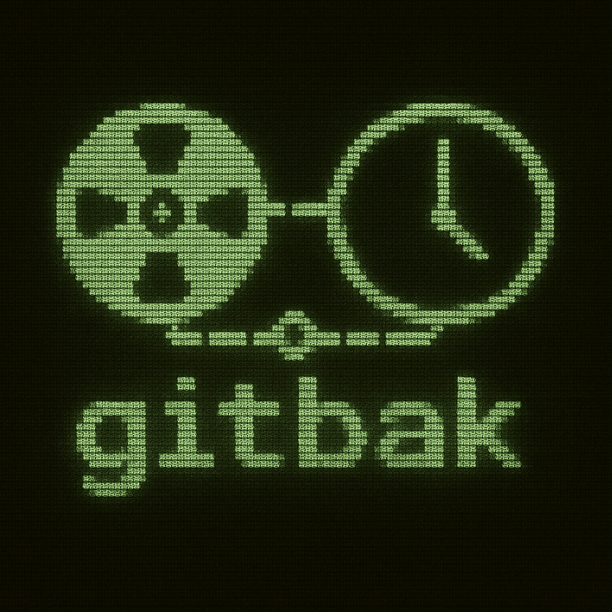

<p style="text-align: center;">
  
</p>

# gitbak - Automatic Commit Safety Net for Pair Programming

This lightweight utility automates creating checkpoint commits during pair programming sessions, providing a safety net against accidental code loss.

**Available Implementations:**
- [Go Version](/go/README.md) - Fast, easy to use native binary with improved architecture.
- [Shell Script Version](/sh/README.md) - Works with bash, zsh, dash, and standard sh but requires POSIX utilities.

## Purpose

When pair programming (with humans or AI assistants like Claude), the conversation and code changes can move quickly.

gitbak provides safety by:

- Allowing you to focus on coding without worrying about losing changes
- Creating automatic commits at regular intervals
- Making a clean history of your pairing session progress
- Providing recovery points if something goes wrong

This helps you avoid common pitfalls like:

- The "I forgot to commit" panic
- The "I thought that git command did something else" confusion
- The "I lost my changes" frustration
- The "I wish we could go back to that thread we pulled on thirty minutes ago" regret

## Features

- Automatically commits changes at specified intervals (default: 5 minutes)
- Creates a dedicated branch for backup commits (configurable)
- Handles concurrent executions safely with file locking
- Continuous tracking with sequential commit numbering
- Support for continuing sessions after breaks or interruptions
- Robust error handling and retry logic
- Clean termination when signals are received (including terminal close)
- Session summary with statistics when you finish

## Quick Start

### Supported Platforms

- **Shell Script Version**: Unix-like systems with a POSIX-compliant shell (Linux, macOS, BSD, etc.)
- **Go Version**: Cross-platform compatibility on all major operating systems where Git is available:
   - Linux (x86_64, ARM64)
   - macOS (Intel and Apple Silicon)
   - Windows (with Git installed)
   - BSD variants

The Go implementation overcomes platform limitations of the shell script version, providing a consistent experience across different environments.

### Shell Script Version

```bash
# Clone the repository
git clone https://github.com/bashhack/gitbak.git

# Navigate to your project repository
cd /path/to/your/project

# Start the auto-commit process
/path/to/gitbak/sh/gitbak.sh

# Press Ctrl+C to stop when finished
```

### Go Version

```bash
# Option 1: Install with Homebrew (macOS and Linux)
brew install bashhack/gitbak/gitbak

# Option 2: Download from GitHub Releases (macOS, Linux, Windows)
# Visit: https://github.com/bashhack/gitbak/releases

# Option 3: Install using Go (requires Go 1.24+)
go install github.com/bashhack/gitbak/go/cmd/gitbak@latest

# Option 4: Build from source
git clone https://github.com/bashhack/gitbak.git
cd gitbak/go
make install

# Navigate to your project repository
cd /path/to/your/project

# Start the auto-commit process
gitbak

# Press Ctrl+C to stop when finished
```

## Implementation Comparison

| Feature         | [Shell Script](sh/README.md)                    | [Go Version](go/README.md)                      |
|-----------------|-------------------------------------------------|-------------------------------------------------|
| Dependencies    | Git, common Unix tools                          | Git                                             |
| Installation    | Copy script, make executable                    | Homebrew, GitHub Releases, or build from source |
| Cross-platform  | Unix-like systems with POSIX shell              | Cross-platform (wherever Git is available)      |
| Resource usage  | ~2-3 MB                                         | ~5-6 MB                                         |
| Configuration   | Environment variables                           | Command-line flags or Environment variables     |
| IDE integration | Commands provided for VS Code, JetBrains, Emacs | Commands provided for VS Code, JetBrains, Emacs |

## After Your Session

When your pairing session is complete, you can:

1. Keep all commits by merging the branch as-is
2. Squash commits into a single meaningful commit
3. Cherry-pick specific changes
4. Discard the branch if you don't need the automatic commits

The most common approach for integrating gitbak changes is the squash merge:

```bash
# Switch back to your main branch
git checkout main

# Combine all gitbak commits into a single change set
git merge --squash gitbak-TIMESTAMP 

# Create a single, meaningful commit with all changes
git commit -m "Add feature X from pair programming session"
```

## License

MIT