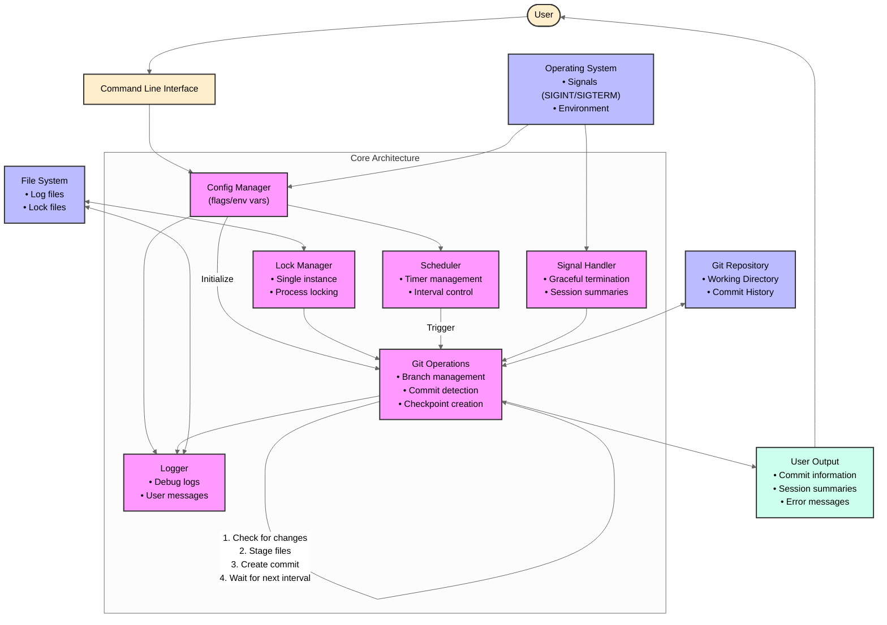

# gitbak: Comparing with Alternatives

This document compares gitbak with alternative approaches to protecting your code during development, particularly IDE auto-save features, and addresses common questions and potential concerns.

## What is gitbak?

gitbak is an automatic checkpoint system for Git repositories that creates regular, timestamped commits of your work. It runs in the background while you code, providing a continuous safety net without requiring you to remember to save or commit. Unlike traditional version control workflows where you manually create commits at logical points, gitbak automatically preserves your work at regular intervals (by default, every 5 minutes).

Key capabilities include:
- Automatic commits at configurable intervals (from seconds to hours)
- Branch management (create new or use existing branch)
- Continuation mode for resuming sessions with sequential commit numbering
- Support for mixing automatic and manual commits
- Detailed session summaries with statistics

Implemented as a lightweight Go application, gitbak works with any editor or IDE, requiring only Git and running as a separate process alongside your development environment.

### Technical Architecture

The diagram below illustrates gitbak's internal architecture:

## Why gitbak Outshines IDE Auto-Save Features

### The Limitations of IDE Auto-Save

IDE auto-save features (like those in VSCode, JetBrains products, etc.) provide only the most basic form of protection:

1. **Limited to File Changes**: They simply write changes to disk without creating proper version history
2. **No Structured History**: Auto-saved versions are temporary and difficult to navigate 
3. **No Persistence**: Most IDE local history is deleted after a period or when closing/restarting
4. **Locked to the IDE**: History is tied to that specific IDE and unavailable elsewhere
5. **No Collaboration**: Auto-saved versions can't be shared with teammates
6. **No Remote Backup**: Changes stay local with no push capability

### Why gitbak is Superior

#### Proper Git Integration
- Creates real Git commits with timestamps, messages, and full metadata
- Integrates with your existing Git workflow rather than creating a parallel system
- Proper commit history that can be navigated with standard Git tools

#### Hybrid Workflow Flexibility
- Combine automatic safety checkpoints with manual milestone commits
- Get both comprehensive protection AND meaningful history
- gitbak intelligently maintains sequential commit numbering despite manual commits

#### Collaboration-Ready
- Commits can be pushed to remote repositories for backup/sharing
- Multiple team members can access the same history
- Perfect for pair programming sessions with detailed trail of progress

#### Platform & IDE Independence
- Works with any editor/IDE – not locked to a specific product
- History persists permanently in your Git repository
- Access history from any device with Git

#### Comprehensive History Management
- After session, choose to:
  - Keep all commits for detailed history
  - Squash commits for a clean history
  - Keep only manual milestone commits via interactive rebase
  - Analyze exactly how your code evolved during the session

#### Safety with Intentionality
- The automatic commits provide safety without requiring constant attention
- Manual milestone commits allow you to mark important points with meaningful messages
- Get both protection against mistakes AND clarity in your repository history

### Real-World Benefits
- **Protection from Accidental Loss**: Never lose code due to IDE crashes, system failures, etc.
- **Detailed Debugging**: Find exactly when bugs were introduced with precise, timestamped commits
- **Recovery of Ideas**: Recover code you tried and abandoned during a session
- **Time Travel**: See exactly what your codebase looked like at any point during development
- **Session Progress**: Track how much was accomplished during a session
- **Branch Management**: Create controlled, dedicated branches for experimental work
- **Flexible Integration**: Choose how to integrate changes back to main branches

## Addressing Common Concerns

While gitbak offers many benefits, here are some reasonable counter-arguments and our responses:

### 1. Git History Pollution

**Concern**: Automatic commits can create excessive noise in Git history, making it harder to understand the meaningful evolution of code.

**Response**: gitbak addresses this through:
- Optional branch isolation (commits occur on a separate branch by default)
- The squash merge workflow for clean integration 
- Support for the hybrid workflow where manual commits mark milestones
- The ability to clean history with interactive rebase before merging

### 2. Performance and Resource Concerns

**Concern**: Running continuous Git operations every few minutes could impact system performance, especially on large repositories or slower machines.

**Response**: 
- gitbak is lightweight (5-6MB memory usage for Go version)
- The interval is configurable (can be longer on larger repos)
- Git operations are generally fast for incremental changes
- The benefits of safety often outweigh small performance impacts

### 3. Potential for Commit Conflicts

**Concern**: If gitbak tries to commit while you're in the middle of a manual commit or other Git operation, it could cause conflicts or disrupt workflow.

**Response**:
- gitbak includes retry logic to handle temporary failures
- The tool is designed to coexist with manual Git operations
- Integration tests confirm that manual and automatic commits work well together

### 4. Modern IDEs Already Provide Local History

**Concern**: Products like JetBrains IDEs have sophisticated local history that can track changes and allow reverting to previous states without formal commits.

**Response**:
- IDE history is typically limited (days/weeks) and doesn't persist long-term
- It's tied to a specific IDE and not shareable or accessible outside that environment
- It cannot be pushed to remote repos for backup or collaboration
- IDE history doesn't integrate with standard Git workflows and tools

### 5. Workflow Disruption

**Concern**: Developers already have established Git workflows, and introducing automatic commits could disrupt those patterns.

**Response**:
- gitbak is designed to complement, not replace, existing workflows
- The separate branch approach keeps automatic commits isolated from regular work
- The hybrid workflow allows maintaining your usual commit patterns with safety in between

### 6. "Just Remember to Commit Regularly"

**Concern**: Good development practice involves regular, meaningful commits. Developers should form this habit rather than relying on automation.

**Response**:
- Even disciplined developers can forget during intense coding sessions
- Regular semantic commits and safety checkpoints serve different purposes
- gitbak provides safety without forcing meaningless commit messages
- The hybrid workflow encourages both habits: automatic safety and meaningful manual commits

## Conclusion

While all tools have tradeoffs, gitbak's design focuses on providing safety without compromising good development practices. By offering features like branch isolation, hybrid workflows, and flexible post-session options, it addresses most potential downsides while delivering significant benefits in terms of safety, history management, and collaboration.

For most developers, especially those working on critical projects, pair programming, or experimenting with new approaches, the safety and recovery benefits of gitbak outweigh these potential concerns.